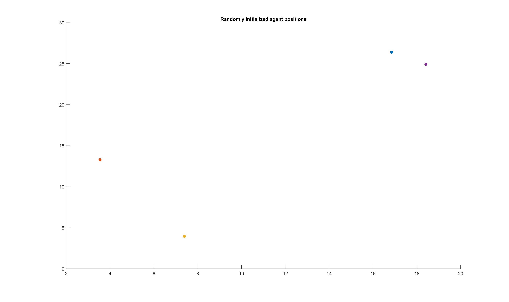
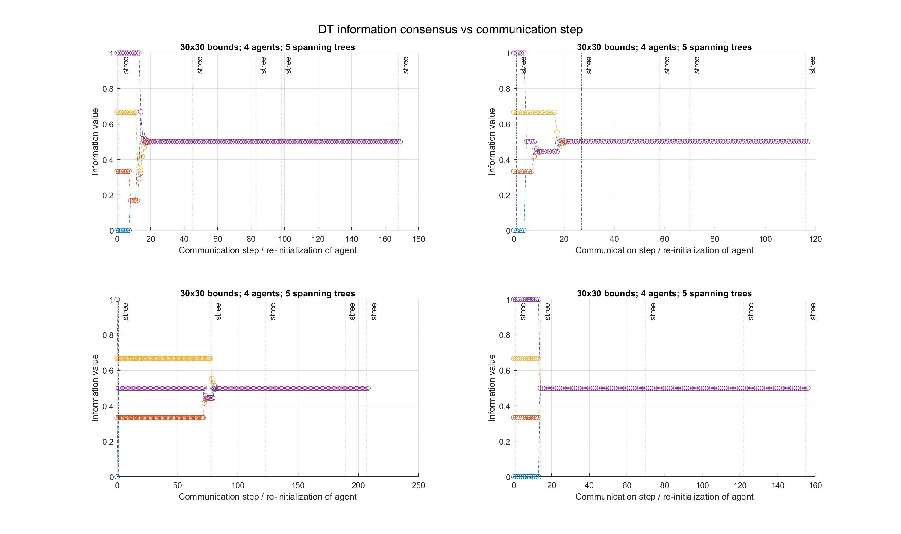
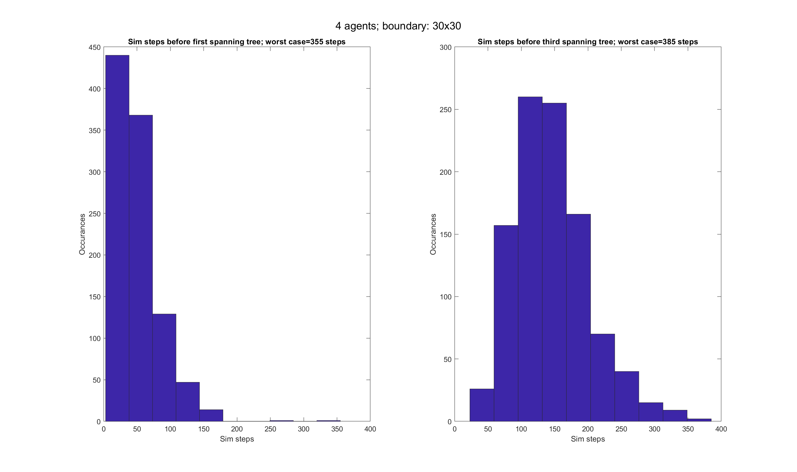

# agent_coordination_stochastic_matrix_convergence
Simplified multi-agent simulation to study emergent connected communications graphs. The position of each agent is randomly generated from a 2-D uniform distribution; this is done each sim step. The communications graph, agents within one another's comms radius, is tracked and the union is taken between each sim step.

Run the simulation in MATLAB via: `agent_random_init_convergence_sim`

##### Simulation -- single sim step

##### Estimation convergence

##### Multi-start statistical trends
